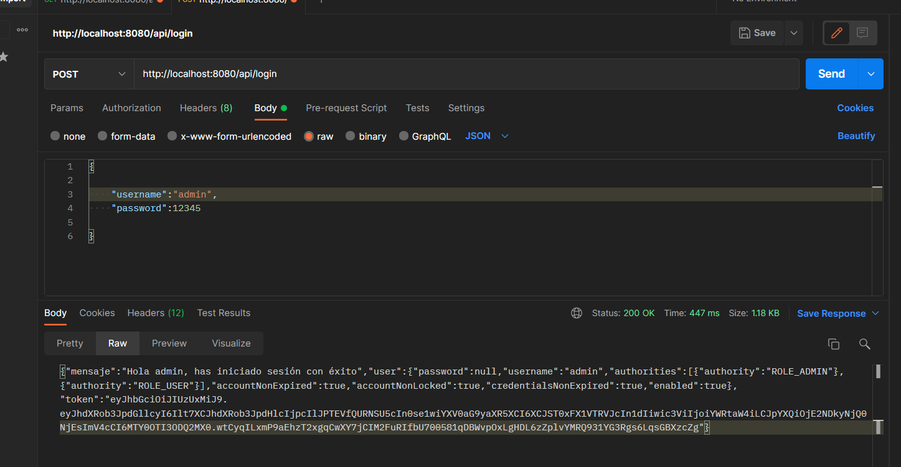
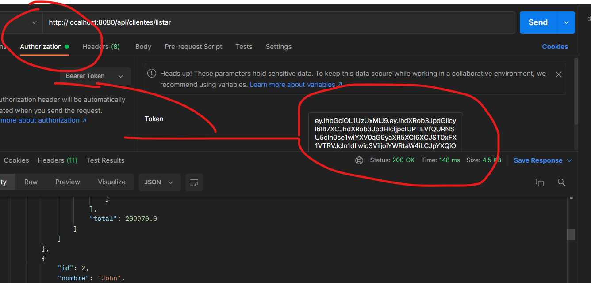

# Getting Started

### Json Web Token (JWT)

Proyecto basado en [Repo-github = App-JPA-Spring-Mysql](https://github.com/cesar-vaesco/App-JPA-Spring-Mysql) para agregar configuraciones para implementar JWT al proyecto. 
 
Para el proyecto, solo se habilito un handler en la clase [ClienteRestController](src/main/java/com/vaescode/springboot/app/controllers/ClienteRestController.java) para usarlo como ejemplo

#### Imagenes de ejemplo del resultado de la implementación

  
   

### Pasos de la implementación de JWT

##### 1 -->
- Agregar dependencias de JWT y actualizar archivo pom.xml
	- https://github.com/jwtk/jjwt
- Desabilitar csrf y declarar como sin estado la sesión en la clase SpringSecurityConfig
	- [clase SpringSecurityConfig](src/main/java/com/vaescode/springboot/app/SpringSecurityConfig.java)
	
- Quitar las referencias a csrf en vistas layout y login 
	- [login](src\main\resources\templates\layout\layout.html)
	
##### 2 -->
- Se elimino el acceso a la ruta del login en la clase SpringSecurityConfig, en este paso al probar nuestra aplicación, no se tienen acceso a ninguna de nuestras rutas: se genera un HTTP ERROR 403 foorbiden
	- [clase SpringSecurityConfig](src/main/java/com/vaescode/springboot/app/SpringSecurityConfig.java)
	
	
##### 3 -->
- Se agrego la clase JWTAuthenticationFilter la cual sirve para autenticar usuario y obtener su token
	- [clase JWTAuthenticationFilter](src/main/java/com/vaescode/springboot/app/auth/filter/JWTAuthenticationFilter.java)
- En la clase se agrego el filter creado en la clase JWTAuthenticationFilter
	- [clase SpringSecurityConfig](src/main/java/com/vaescode/springboot/app/SpringSecurityConfig.java)
	
##### 4 --> 
- Generación de token
	- [clase JWTAuthenticationFilter](src/main/java/com/vaescode/springboot/app/auth/filter/JWTAuthenticationFilter.java)

##### 5 --> 
- Agregando al token fecha de creación y expiración ádemas de los roles 
	- [clase JWTAuthenticationFilter](src/main/java/com/vaescode/springboot/app/auth/filter/JWTAuthenticationFilter.java)
	
##### 6 --> 
- Agregando configuraciones para recibir datos sin procesar(raw data) y mostrarlos en la consola
	- [clase JWTAuthenticationFilter](src/main/java/com/vaescode/springboot/app/auth/filter/JWTAuthenticationFilter.java)
	
##### 7 -->
- Configuración para retornar respuesta en caso de error en la petición de login 
	- [clase JWTAuthenticationFilter](src/main/java/com/vaescode/springboot/app/auth/filter/JWTAuthenticationFilter.java)

##### 8 -->
- Configurando clase filtro JWTAuthorizationFilter para poder acceder a los recursos de la app usando el token generado
	- [clase JWTAuthorizationFilter](src/main/java/com/vaescode/springboot/app/auth/filter/JWTAuthorizationFilter.java)
	
##### 9 -->
- Validación de token para acceder a los recursos
	- [clase JWTAuthorizationFilter](src/main/java/com/vaescode/springboot/app/auth/filter/JWTAuthorizationFilter.java)
	
##### 10 -->
- Realizando autenticación con el token JWT enviado por el cliente
	- [clase JWTAuthorizationFilter](src/main/java/com/vaescode/springboot/app/auth/filter/JWTAuthorizationFilter.java)0
	
##### 11 -->
- Creando la clase SimpleGrantedAuthoritiesMixin para poder pasar parametros a los header de la petición

	- Un Mixin es una forma de incluir métodos de una clase en otra, sin que exista relación de herencia entre ellas. En cierto sentido se puede ver como una especie de “herencia” múltiple, pero sin existir relación de especialización entre las clases
	 
	- [clase SimpleGrantedAuthoritiesMixin](src/main/java/com/vaescode/springboot/app/auth/SimpleGrantedAuthoritiesMixin.java)

##### 12 -->
- Creando la clase servicio y su interfaz de JWT
	-  [interfaz JWTService](src/main/java/com/vaescode/springboot/app/auth/service/JWTService.java)
	-  [clase JWTServiceImpl](src/main/java/com/vaescode/springboot/app/auth/service/JWTServiceImpl.java)
	
##### 13 -->
- Implementando y optimizando con la clase de servicio JWT las clases JWTAuthorizationFilter y JWTAuthenticationFilter
	- [clase JWTServiceImpl](src/main/java/com/vaescode/springboot/app/auth/service/JWTServiceImpl.java)  
	- [clase JWTAuthorizationFilter](src/main/java/com/vaescode/springboot/app/auth/filter/JWTAuthorizationFilter.java)  
	- [clase JWTAuthenticationFilter](src/main/java/com/vaescode/springboot/app/auth/filter/JWTAuthenticationFilter.java) 
	
	
##### 13 -->
- Constantes en el servicio de JWT e implementandolas en las clases JWTAuthorizationFilter y JWTAuthenticationFilter
	- [clase JWTServiceImpl](src/main/java/com/vaescode/springboot/app/auth/service/JWTServiceImpl.java)  
	- [clase JWTAuthorizationFilter](src/main/java/com/vaescode/springboot/app/auth/filter/JWTAuthorizationFilter.java)  
	- [clase JWTAuthenticationFilter](src/main/java/com/vaescode/springboot/app/auth/filter/JWTAuthenticationFilter.java) 
	
	
	
	